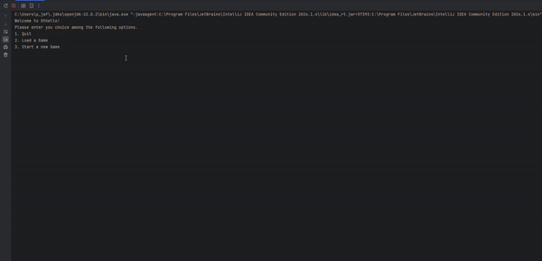
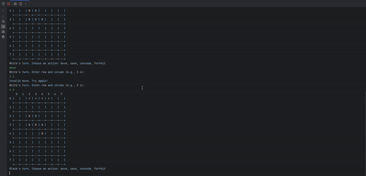
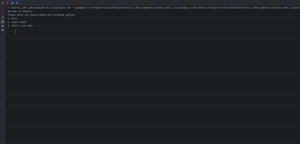

# Object-Oriented Othello Game

Welcome to the **Object-Oriented Othello Game**! This project is a fully functional implementation of the classic Othello game, designed in Java with a modular, object-oriented approach. This game is built for those interested in a complete, interactive experience of Othello, along with features like game saving and resuming.

---

## Overview
This Othello game was developed using **Java** and follows the principles of **Object-Oriented Programming (OOP)**. The codebase is structured with modular classes, including `Board`, `Game`, `Player`, `Position`, `PlayablePosition`, and `UnplayablePosition`, to handle various aspects of the game logic. The modularity of the code allows for easy expansion and understanding of game mechanics.

---

## Features
- **Object-Oriented Design**: A modular architecture with classes like `Board`, `Game`, and `Player` for clear organization and maintainability.
- **Game-Saving Functionality**: Players can save their progress and resume the game at any time, adding flexibility and enhancing the user experience.
- **Position Management System**: Efficiently manages board positions using classes that illustrate concepts of inheritance and encapsulation.
- **User-Friendly Interface**: Simple console-based interface that is easy to interact with, suitable for Othello enthusiasts and developers alike.

---

## Demo

### 1. Gameplay
Players take turns placing their pieces on the board. If an invalid position is selected, they are prompted to retry.  

---

### 2. Saving Functionality
Save your game at any point to resume later.  

---

### 3. Loading and Forfeit Restrictions
Load a previously saved game. If a player attempts to forfeit with valid moves remaining, they are informed that forfeiting is not allowed.  

---

## Architecture
The game’s structure is built around key classes:
- **`Board`**: Manages the game board, including the setup and display of pieces.
- **`Game`**: Handles game flow, rules, and main gameplay loop.
- **`Player`**: Represents each player and their moves.
- **`Position`, `PlayablePosition`, and `UnplayablePosition`**: Classes that manage board positions, allowing for flexible handling of playable and unplayable cells.

This object-oriented architecture demonstrates proficiency in **inheritance** and **encapsulation**, as each class encapsulates specific game functionality.
